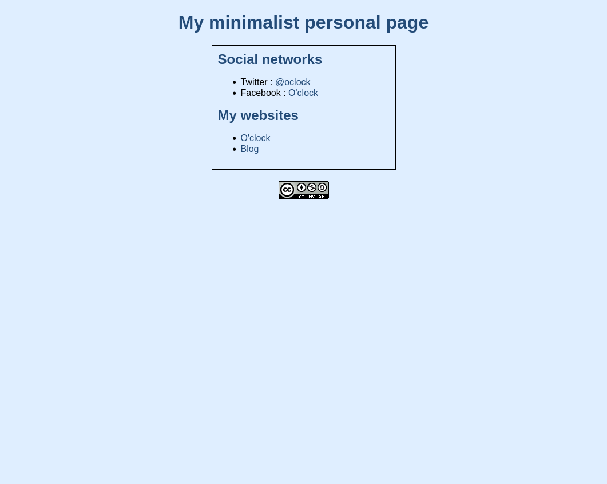

# My personal page

## Objectif
L'objectif de cet exercice est de réaliser une page web qui se rapproche le plus possible de l'image suivante.

## Maquette

## Informations

Il n'est pas attendu de copier cette maquette au pixel près, on essaie de s'en approcher le plus possible.

Les couleurs sont les suivantes : 
- Fond : `rgb(223, 238, 255)`
- Titres & liens : `#234b78`

Le bloc principal doit être centré, et mesure 300px de large.

La taille de la police par défaut est de 16px.
Le titre principal fait 2x la taille de la police par défaut.
Les titres secondaires font 1.5x la taille de la police par défaut.
